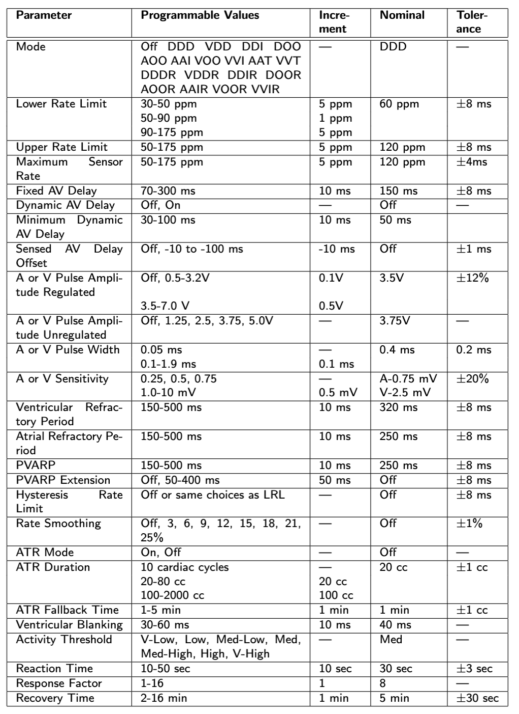
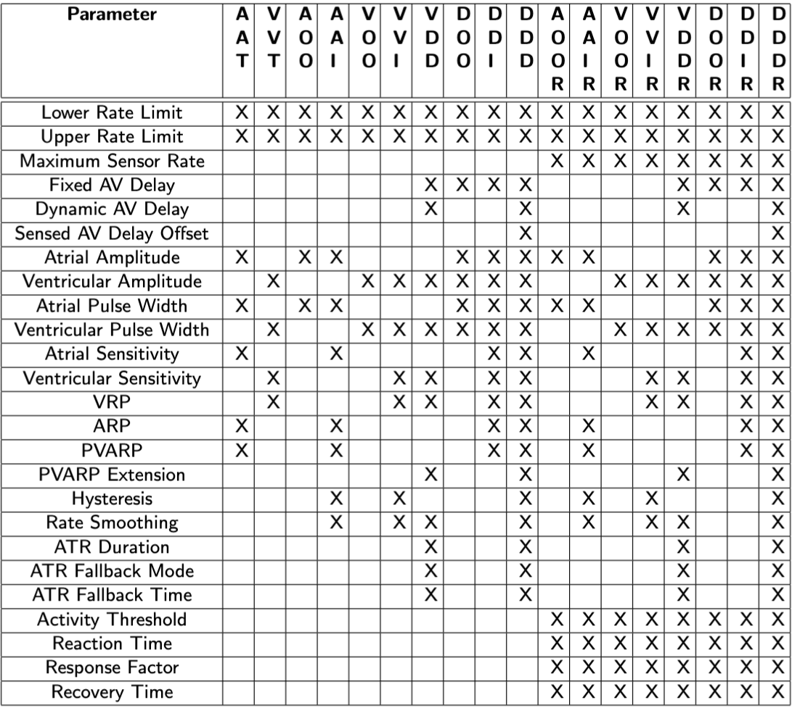
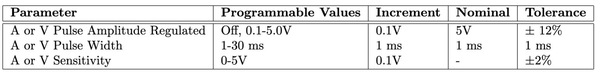

## D2：按文件需要“增加/修改”的内容（概念清单）

## 0. 总览清单（D2 新增大项）

1. **模式扩展为 8 种**：AOO、VOO、AAI、VVI、AOOR、VOOR、AAIR、VVIR
2. **串口通信**：DCM↔Pacemaker 双向通信（参数下发 / 回读、egram 实时流）
3. **参数闭环验证**：Set → Send → Store → **Read-Back → Verify**
4. **Egram 实时显示**：从串口收数据，房/室/双通道切换，稳定刷新
5. **参数范围/步进/容差**：按 D2 规范更新 UI 与校验
6. **安全/日志/帮助**：故障降级、操作追溯、Help 内容更新
7. **文档/测试支撑**：Assurance Case、Heartview 测试记录（放在报告，不在代码）
   
   
   

### 1. mode_config

1. 需要增加四个新 mode，新增 **AAI、AOOR、VOOR、AAIR、VVIR** 的参数面板与元数据。其 getter，setter 和步进信息都需要补上；同时，pulse amplitude 和 pulse width 都需要修改，详情见 D2_req 文档。四种模式所需的所有参数也需要写在这里面。
2. 相应的 mode 所需参数要写上，同时，setter，getter 要写出来，并且正确步进。

### 2. Help_window 和 json 文件

增加关于新参数和新模式的说明。

### 3. dashboard

1. 需要修改状态指示灯的部分，改成从 pacemaker 读取状态然后修改 boolean 展示状态灯。
2. 调整布局以及增加新增的参数的编辑选项，注意，activity threshold 改成下拉菜单选择而不是手动输入。

### 4. paramOps

1. 修改 load 的部分，改成可以传到 pacemaker 里面。
2. 增加一个 compare 功能，按下 apply 的时候，先检查 pacemaker 里面是否和 DCM 的参数一致，如果不一致，弹出报错，必须先 load。

### 5. EGdiagram

删除 MockEgramSource，改为从 Pacemaker 读取真实的参数并且画图。如果画图过程中断开，那么立刻终止画图；信号不稳定的时候，弹出警告信息信号不稳定。

### 6. Communication 和 serial

创建一个 serial 的底层文件，里面实现通讯的内部细节，communication 来实现它。communication 负责实现所有读取的内容和读取什么，然后发送给其他文件。读取的数据比较的函数在这里实现，然后 paramOps 调用就行，比较的容忍值按照参数表来。
